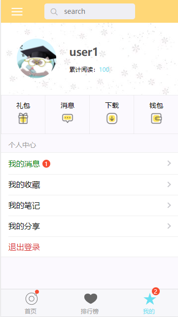

# vuxdemo

> vux test

## Build Setup

``` bash
# install dependencies
npm install

# serve with hot reload at localhost:8080
npm run dev

# build for production with minification
npm run build

# build for production and view the bundle analyzer report
npm run build --report

# run unit tests
npm run unit

# run e2e tests
npm run e2e

# run all tests
npm test

# add css loader
npm install css-loader style-loader postcss-loader --save-dev
npm install less less-loader --save
```

## 页面
#### 首页


#### 列表


#### 用户


#### 详情


#### 登录


（项目中的图片和文字均来源于网络，如有侵权请联系我删除）

For a detailed explanation on how things work, check out the [guide](http://vuejs-templates.github.io/webpack/) and [docs for vue-loader](http://vuejs.github.io/vue-loader).
